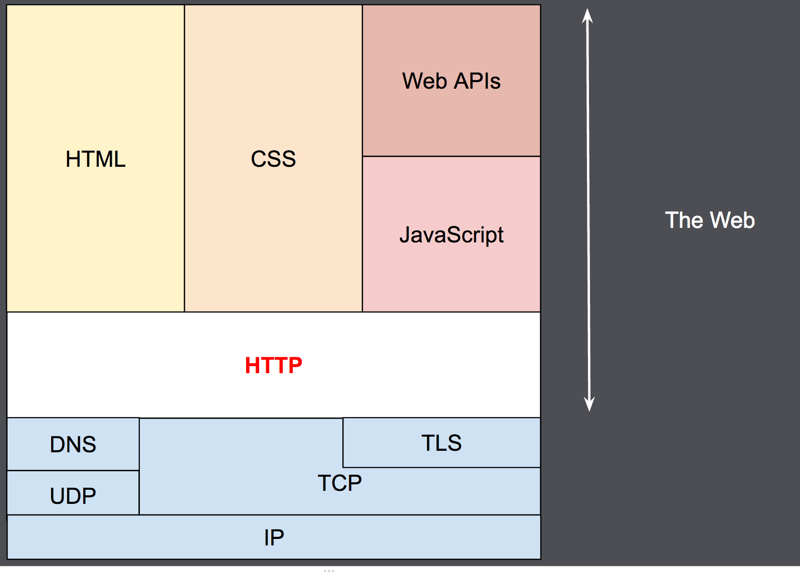

# HTTP e HTTPS

HTTP is a [Protocol](./Protocolo.md) to fetch resources as HTML documents. It is the foundation of any data exchange on the Web, and it is a client-server [Protocol](./Protocolo.md), which means requests are initiated by the recipient, usually the Web browser. A complete document is typically constructed from resources such as text content, layout instructions, images, videos, scripts, and more.

Clients and servers communicate by exchanging individual messages (as opposed to a stream of data). The messages sent by the client are called requests and the messages sent by the server as an answer are called responses.

Designed in the early 1990s, HTTP is an extensible protocol which has evolved over time. It is an application layer [protocol](./Protocol.md) that is sent over [TCP](./TCP.md), or over a [TLS](./TLS.md)-encrypted [TCP](./TCP.md) connection.

## References

1. [An overview of HTTP](https://developer.mozilla.org/en-US/docs/Web/HTTP/Overview#components_of_http-based_systems)
