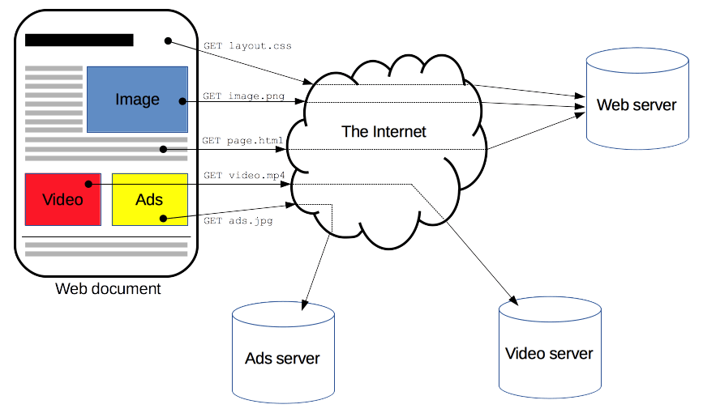

# HTTP e HTTPS e protocolo TLS

HTTP é um [Protocolo](./Protocolo.md) para requisições de recursos como documentos HTML. É a fundação de qualquer troca de dados na Web e é um [Protocolo](./Protocolo.md) cliente-servidor, o que significa que as requisições serão iniciadas pelo recipiente, normalmente um navegador. Um documento completo é reconstruído de diferentes sub-documentos recuperados, do tipo, texto, descrição dos layouts, imagens, vídeos, códigos e mais.

Clientes e servidores comunicam-se trocando mensagens individuais (ao invés de uma cadeia contínua de dados). As mensagens enviadas pelo cliente, normalmente um navegador, são chamados *requests* (requisições) e as mensagens enviadas pelo servidor em formato de resposta são chamadas *reponses* (respostas).

Desenvolvido no início dos anos 90, HTTP é um protocolo extensível que evoluiu temporalmente. É um protocolo da camada de aplicação enviado através do TCP

